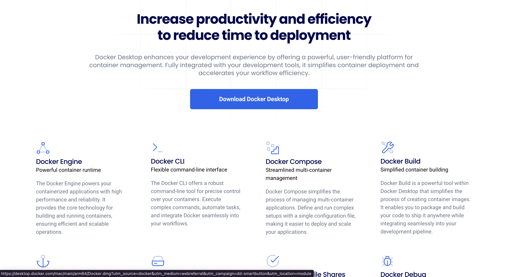
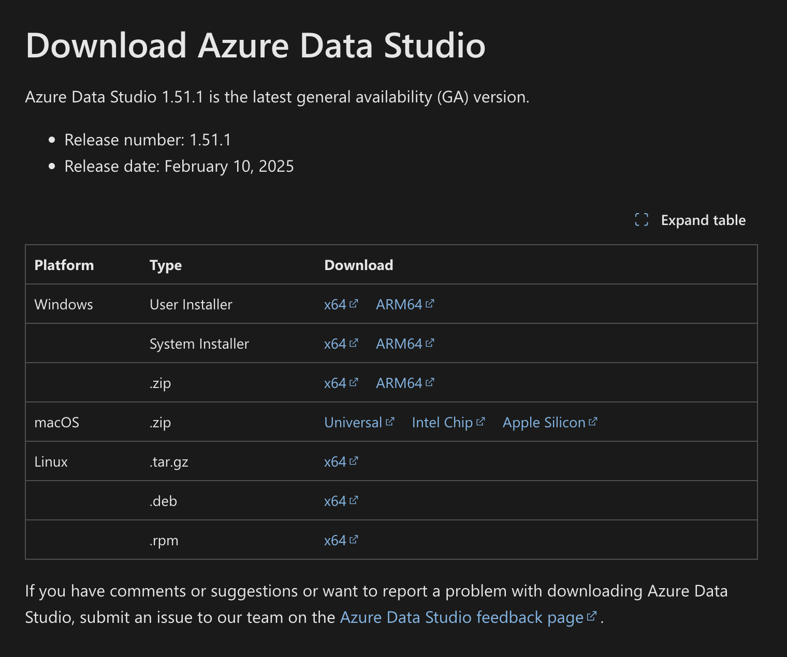
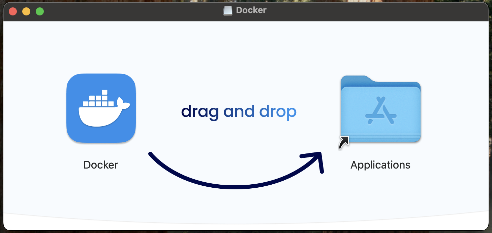
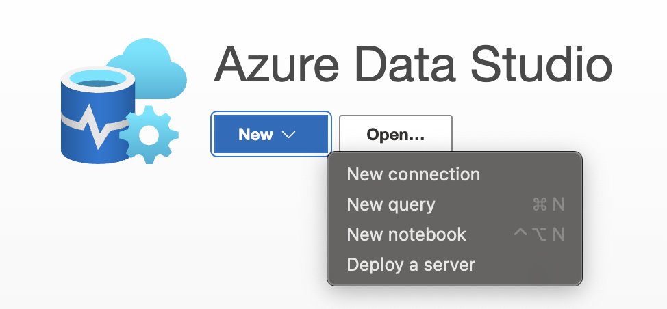
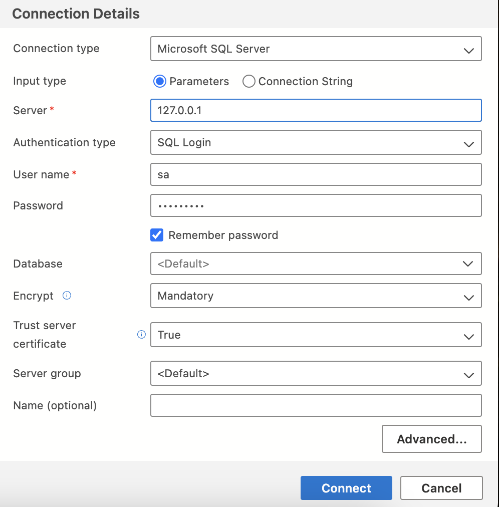
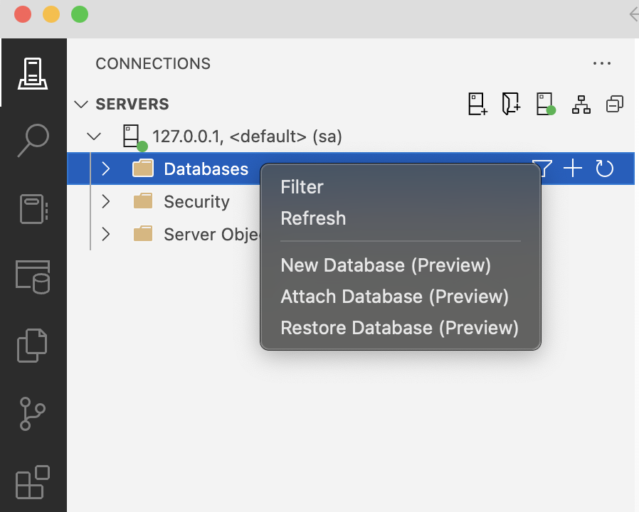
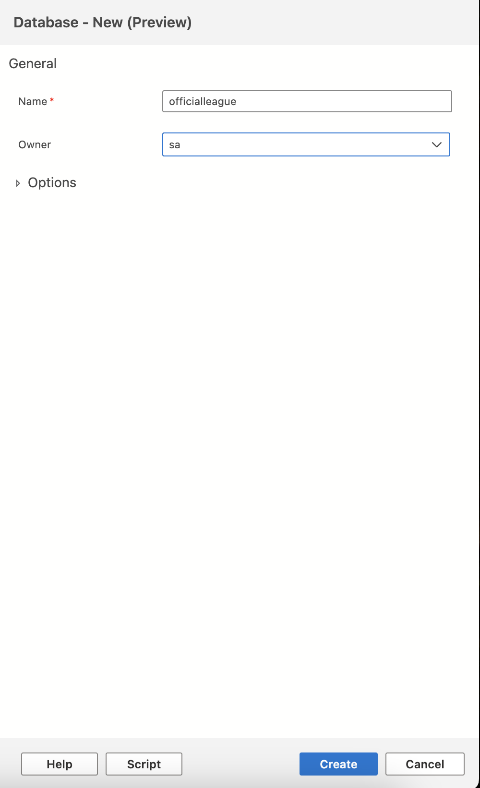
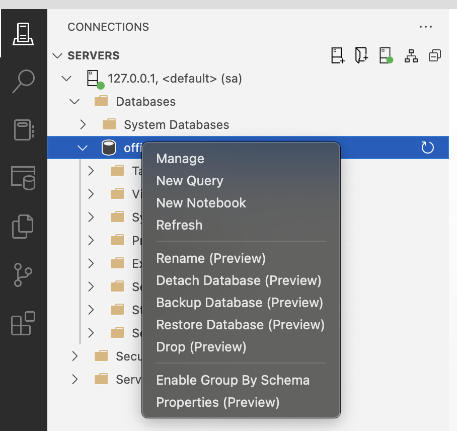
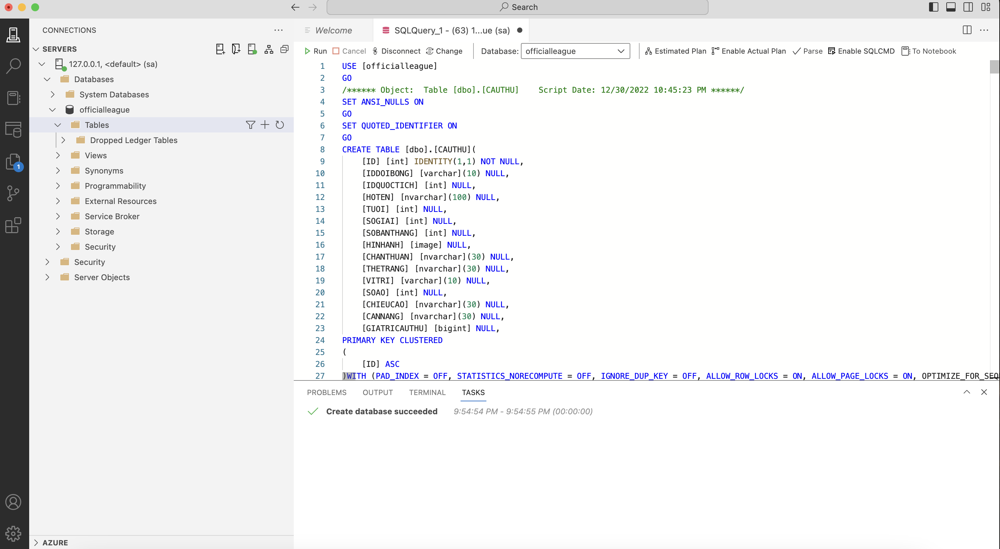
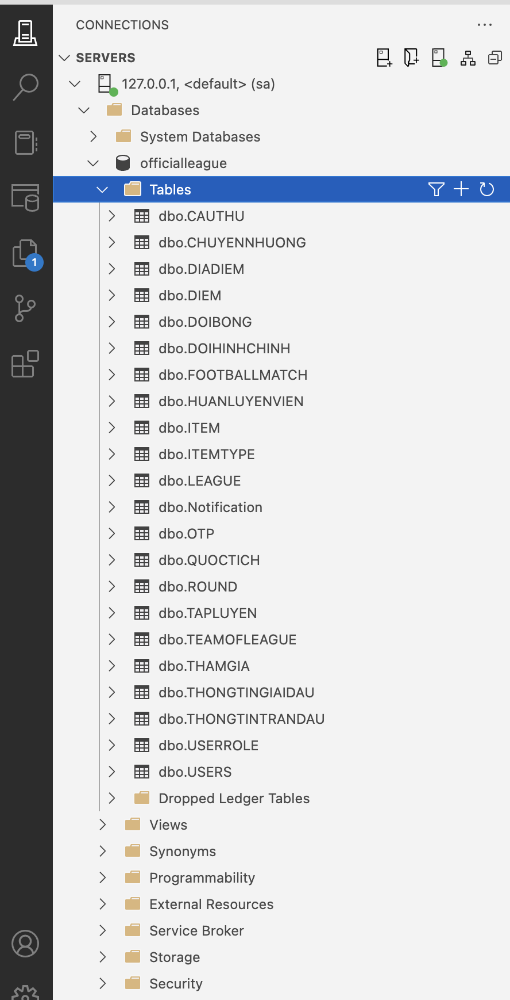

# 🐳 Hướng dẫn Cài đặt SQL Server Docker trên macOS

## 📋 Yêu cầu hệ thống
- macOS 11 (Big Sur) trở lên
- CPU hỗ trợ ảo hóa (Apple Silicon M1/M2/M3 hoặc Intel)
- Dung lượng trống: ~1GB
- Tài khoản có quyền Admin

## 🔽 Bước 1: Tải Docker Desktop

Truy cập link sau để tải Docker Desktop:
👉 [https://www.docker.com/products/docker-desktop](https://www.docker.com/products/docker-desktop)


Chọn bản phù hợp với chip máy của bạn:
- **Intel chip**: dành cho Mac đời cũ
- **Apple chip (M1/M2/M3)**: dành cho Mac mới hơn


## 🧱 Bước 2: Cài đặt Docker

1. Mở file `.dmg` vừa tải về
2. Kéo biểu tượng Docker vào thư mục **Applications**

3. Mở ứng dụng **Docker Desktop**
4. Làm theo hướng dẫn và cấp quyền khi được yêu cầu

5. Chờ biểu tượng 🐳 hiện trên thanh menu → Docker đã sẵn sàng

## ✅ Bước 3: Kiểm tra cài đặt

Mở **Terminal**, chạy lệnh sau:

```bash
docker -v
```

Kết quả ví dụ:
```
Docker version 28.0.1, build 068a01e
```

## ⚙️ Docker Compose

Docker Desktop đã bao gồm sẵn Docker Compose. Kiểm tra bằng lệnh:

```bash
docker-compose --version
```

Kết quả ví dụ:
```bash
Docker Compose version 2.32.4
```

## ✅ Bước 4: Chạy và dừng Docker SQL Server trên MacOS

Mở **Terminal**, ở thư mục **Huong-Dan-Cai-Dat-FootBallManager-Tren-MacOS** chạy lệnh sau:

Chạy Docker Compose:
```bash
docker-compose up -d
```

Dừng Docker Compose:
```bash
docker-compose down
```

## ✅ Bước 5: Chạy Azure Data Studio trên MacOS để kết nối đến Docker SQL Server

Truy cập link sau để tải Azure Data Studio:
👉 [https://learn.microsoft.com/en-us/azure-data-studio/download-azure-data-studio](https://learn.microsoft.com/en-us/azure-data-studio/download-azure-data-studio?view=sql-server-ver16&tabs=win-install%2Cwin-user-install%2Credhat-install%2Cwindows-uninstall%2Credhat-uninstall)

Chọn bản phù hợp với chip máy của bạn:
- **Intel chip**: dành cho Mac đời cũ
- **Apple chip (M1/M2/M3)**: dành cho Mac mới hơn

Chạy Azure Data Studio và thực hiện các bước sau để tiến hành tạo database.

- Chọn New -> Connection để tạo connection tới Docker SQL Server.


- Điên thông tin giống trong hình.
+ Server: ***127.0.0.1***
+ User: ***sa***
+ Password: ***admin@123***
+ Trust server certificate: ***True***


- Tạo database 
+ Chọn Database -> Nhấp chuột phải -> New Database (Preview)


+  Name: ***officialleague***
+  Owner: ***sa***


- Chạy official.sql thêm dữ liệu vào ***officialleague***
+ Chọn database  ***officialleague*** -> nhấp phải chuột -> chọn New Query.

+ Sao chép nội dung của file ***official.sql*** rồi dán vào edit của New Query -> nhấn nút Run.

+ Mở Tables của database  ***officialleague*** xem có các table giống như hình bên dưới.

