# 🐳 Hướng dẫn Cài đặt SQL Server Docker trên macOS

## 📋 Yêu cầu hệ thống
- macOS 11 (Big Sur) trở lên
- CPU hỗ trợ ảo hóa (Apple Silicon M1/M2/M3 hoặc Intel)
- Dung lượng trống: ~1GB
- Tài khoản có quyền Admin

## 🔽 Bước 1: Tải Docker Desktop

Truy cập link sau để tải Docker Desktop:  
👉 [https://www.docker.com/products/docker-desktop](https://www.docker.com/products/docker-desktop)


Chọn bản phù hợp với chip máy của bạn:
- **Intel chip**: dành cho Mac đời cũ
- **Apple chip (M1/M2/M3)**: dành cho Mac mới hơn


## 🧱 Bước 2: Cài đặt Docker

1. Mở file `.dmg` vừa tải về 
2. Kéo biểu tượng Docker vào thư mục **Applications**


3. Mở ứng dụng **Docker Desktop**  
4. Làm theo hướng dẫn và cấp quyền khi được yêu cầu

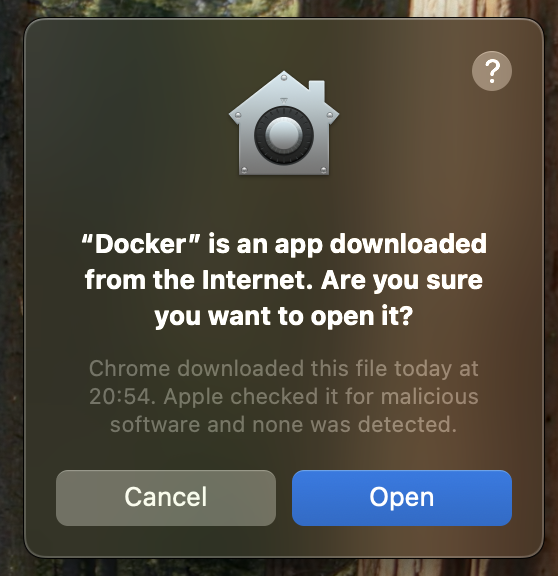

5. Chờ biểu tượng 🐳 hiện trên thanh menu → Docker đã sẵn sàng

## ✅ Bước 3: Kiểm tra cài đặt

Mở **Terminal**, chạy lệnh sau:

```bash
docker -v
```

Kết quả ví dụ:
```
Docker version 28.0.1, build 068a01e
```

## ⚙️ Docker Compose

Docker Desktop đã bao gồm sẵn Docker Compose. Kiểm tra bằng lệnh:

```bash
docker-compose --version
```

Kết quả ví dụ:
```
Docker Compose version 2.32.4
```

## ✅ Bước 4: Chạy và dừng Docker SQL Server trên MacOS

Mở **Terminal**, ở thư mục **Huong-Dan-Cai-Dat-FootBallManager-Tren-MacOS** chạy lệnh sau:

Chạy Docker Compose:
```bash
docker-compose up -d
```

Dừng Docker Compose:
```bash
docker-compose down
```

## ✅ Bước 5: Chạy Azure Data Studio trên MacOS để kết nối đến Docker SQL Server

Truy cập link sau để tải Azure Data Studio:  
👉 [https://learn.microsoft.com/en-us/azure-data-studio/download-azure-data-studio](https://learn.microsoft.com/en-us/azure-data-studio/download-azure-data-studio?view=sql-server-ver16&tabs=win-install%2Cwin-user-install%2Credhat-install%2Cwindows-uninstall%2Credhat-uninstall)

Chọn bản phù hợp với chip máy của bạn:
- **Intel chip**: dành cho Mac đời cũ
- **Apple chip (M1/M2/M3)**: dành cho Mac mới hơn

Chạy Azure Data Studio và thực hiện các bước sau để tiến hành tạo database.

- Chọn New -> Connection để tạo connection tới Docker SQL Server.  


- Điền thông tin giống trong hình:  
  + Server: ***127.0.0.1***  
  + User: ***sa***  
  + Password: ***admin@123***  
  + Trust server certificate: ***True***  


- Tạo database:  
  + Chọn Database -> Nhấp chuột phải -> New Database (Preview)  


  + Name: ***officialleague***  
  + Owner: ***sa***  


- Chạy `official.sql` để thêm dữ liệu vào ***officialleague***

  + Chọn database ***officialleague*** -> nhấp phải chuột -> chọn New Query  


  + Sao chép nội dung của file `official.sql` rồi dán vào editor của New Query -> nhấn nút Run  


  + Mở Tables của database ***officialleague*** để xem các bảng giống như hình  


## ✅ Bước 6: Cài đặt VMWare để chạy Windows 11 trên macOS với CPU M1/M2/M3/M4

### 🔗 Tải về phần mềm cần thiết

- Tải **VMWare Fusion** tại:  
👉 [VMWare Fusion Download](https://drive.google.com/file/d/1c04Cp7eOti4FhwiP7Slsu1e6JVSGhfWF/view?usp=sharing)

- Tải **Windows 11 ARM** tại:  
👉 [Windows 11 ARM Download](https://drive.google.com/file/d/12p-OUDRGajjLio3tCdOY-umm_VRHSHTX/view?usp=sharing)

---

### 🔧 Các bước cài đặt

1. Nhấp đúp vào file `VMware-Fusion-13.6.3-24585314_universal.dmg`  
   → Sau đó tiếp tục nhấp đúp vào biểu tượng **VMWare Fusion**  
   

2. Chọn **Install from disc or image**  
   

3. Chọn **Use another disc or disc image...**  
   → Dẫn đến file `Windows11_26100.2033_Professional_en-us_arm64.iso`  
   → Chọn **OK** → Chọn **Continue**  
   

4. Giữ mặc định → Chọn **Continue**  
   

5. Đặt **mật khẩu** cho máy ảo  
   

---

### ⚙️ Cấu hình máy ảo

6. Nhấp vào biểu tượng **mỏ lết** để cấu hình  
   

7. Chọn **Processor và Memory**  
   

8. Chọn số **nhân CPU** và **RAM** mong muốn  
   

9. Chọn **Hard Disk** để cấu hình ổ cứng  
   

10. Thiết lập dung lượng ổ cứng → Chọn **Apply**  
    

---

### ▶️ Khởi chạy và hoàn tất

11. Nhấp vào biểu tượng **Play** để chạy máy ảo  
    

12. Khi xuất hiện dòng `Press any key to boot from CD or DVD`  
    → Nhấn phím bất kỳ để bắt đầu cài đặt Windows 11.  
    → Lưu ý: Hãy **nhớ mã PIN** để đăng nhập sau này.  
    

13. Sau khi cài đặt và đăng nhập Windows 11:  
    → Trên menu chính của VMWare Fusion, chọn:  
    **Virtual Machine** → **Install VMWare Tools**  
    

14. Vào thư mục gốc `DVD Driver VMWare Tools`  
    → Nhấp vào `setup.exe` để cài đặt mặc định  
    → **Restart máy ảo** sau khi cài để cập nhật độ phân giải và hỗ trợ phần cứng  
    

## ✅ Bước 7: Cài đặt FootBallManager trên máy ảo

### 🔗 Tải về phần mềm cần thiết

* Tải **QuanLyBongDa.zip** tại:
  👉 [FootBallManager](https://drive.google.com/file/d/1Peu73PUbPSuc-xxpEAdH8pGOmXuaY383/view?usp=sharing)

---

### 🔧 Các bước cài đặt

1. Giải nén file `QuanLyBongDa.zip`
   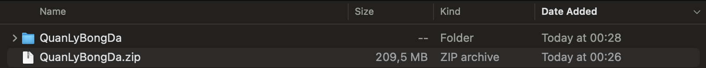

2. Vào thư mục `QuanLyBongDa` → Giải nén tiếp tập tin `Release.zip`
   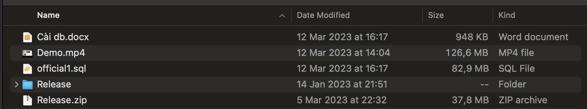

3. Mở thư mục `Release`, sao chép file `SetupFBM.msi` (Command + C)
   → Dán vào trong máy ảo (Ctrl + V)
   

4. Nhấp đúp vào tập tin `SetupFBM.msi` trong máy ảo để bắt đầu cài đặt
   

5. Chọn `Next` để tiếp tục
   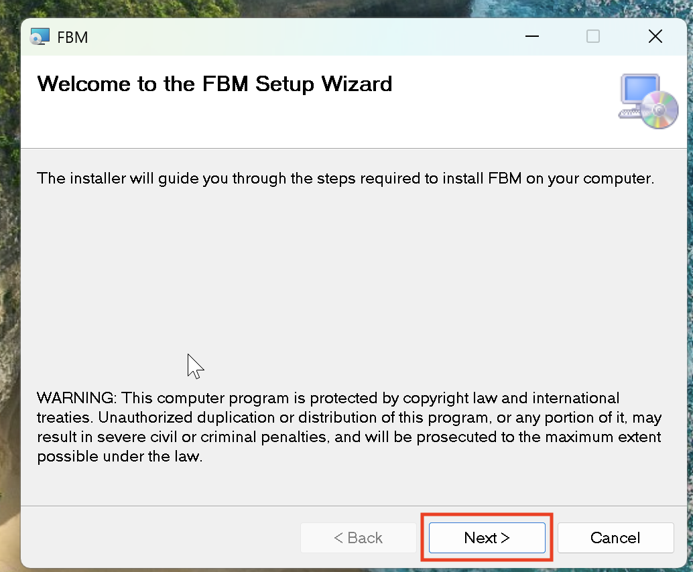

6. Chọn `Next` để xác nhận thư mục cài đặt

   > 💡 **Lưu ý:** Ghi nhớ đường dẫn cài đặt (mặc định là:
   > `C:\Program Files (x86)\Tuong_301\FBM`) để cấu hình file sau này
   > 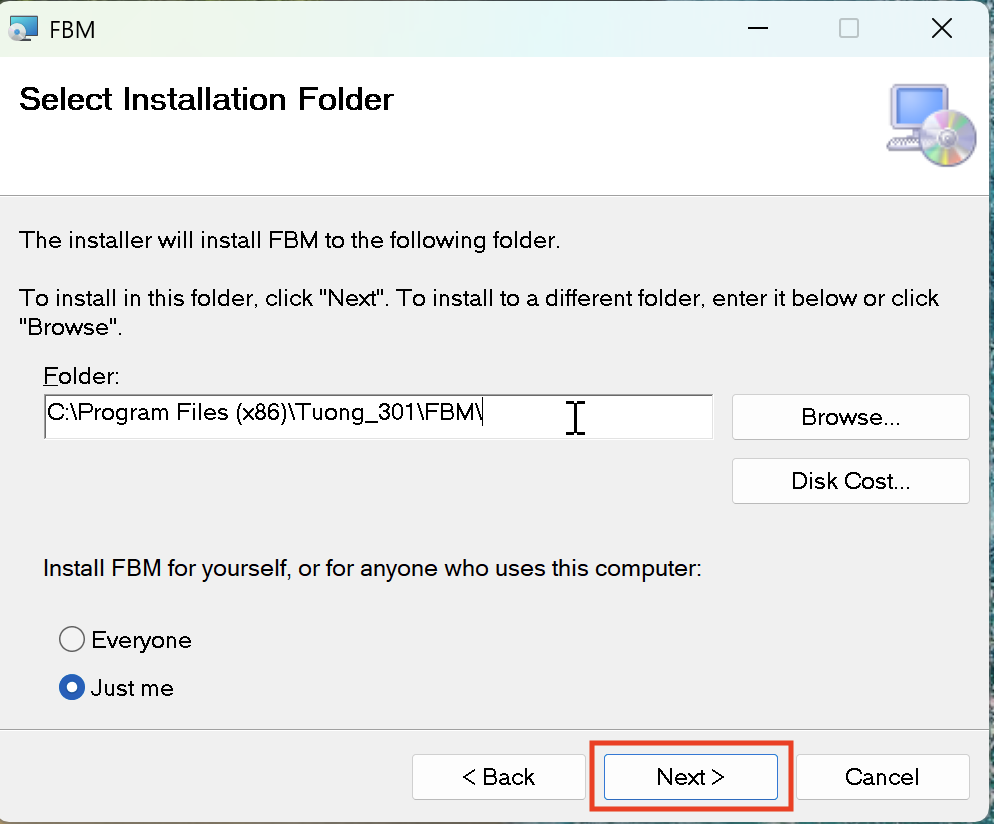

7. Chọn `Next` một lần nữa để xác nhận
   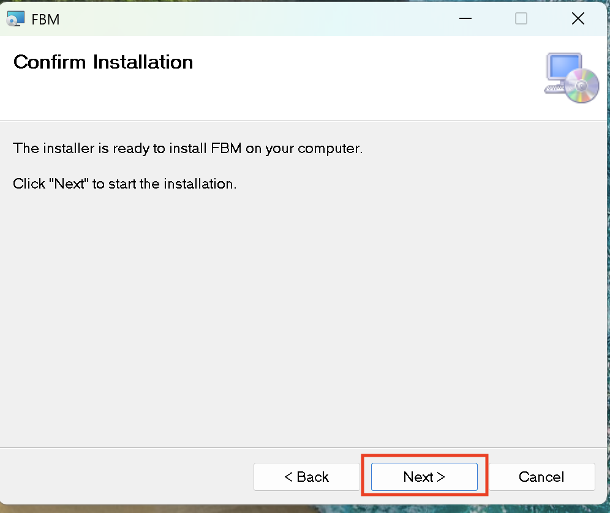

8. Chọn `Yes` để cho phép hệ điều hành cài đặt phần mềm
   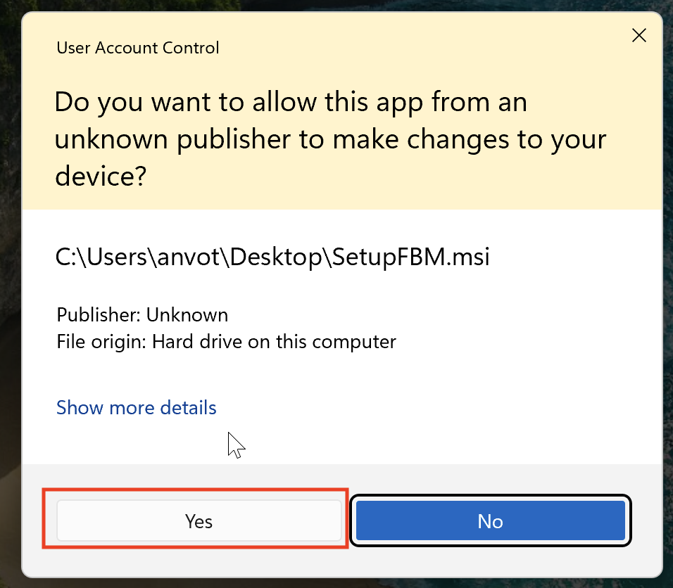

9. Chọn `Close` để hoàn tất quá trình cài đặt
   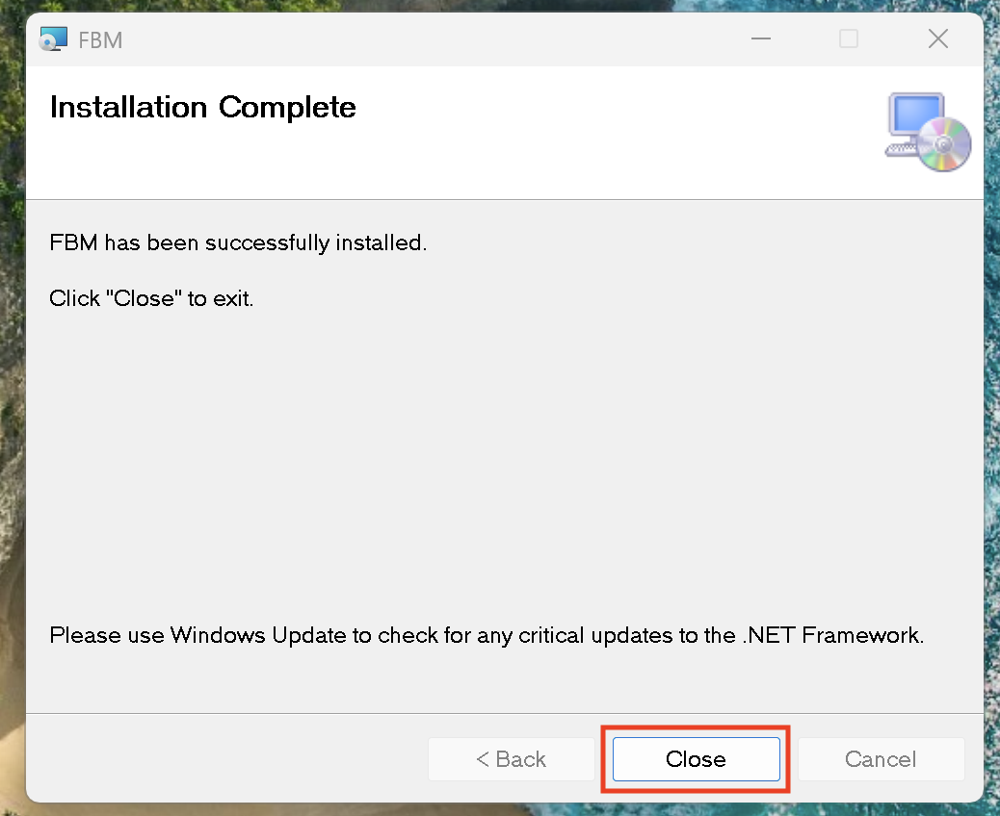

10. Kiểm tra màn hình Desktop xem có icon phần mềm `FootBallManager`
    → Nếu có, quá trình cài đặt đã thành công
    

---

## ✅ Bước 8: Cập nhật cấu hình FootBallManager trên máy ảo

### 🔗 Tải về file cấu hình

* Tải **FootBallProject.exe.config** tại:
  👉 [FootBallProject.exe.config](https://drive.google.com/file/d/183swd0mj32nYi0OfkoTn7NkcaCMEWGgp/view?usp=sharing)

---

### 🔧 Các bước cập nhật

1. Trên máy Mac, mở Terminal và gõ lệnh sau để lấy IP nội bộ (IP Local):

   ```bash
   ipconfig getifaddr en0
   ```

   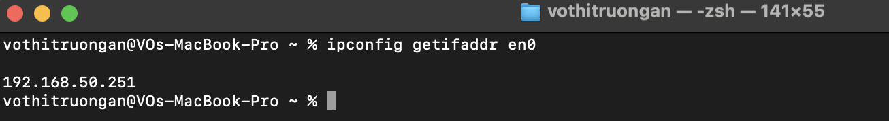

2. Mở tập tin `FootBallProject.exe.config` bằng trình soạn thảo (VD: Notepad++)
   → Tìm và thay IP `192.168.50.9` thành IP Local bạn vừa lấy
   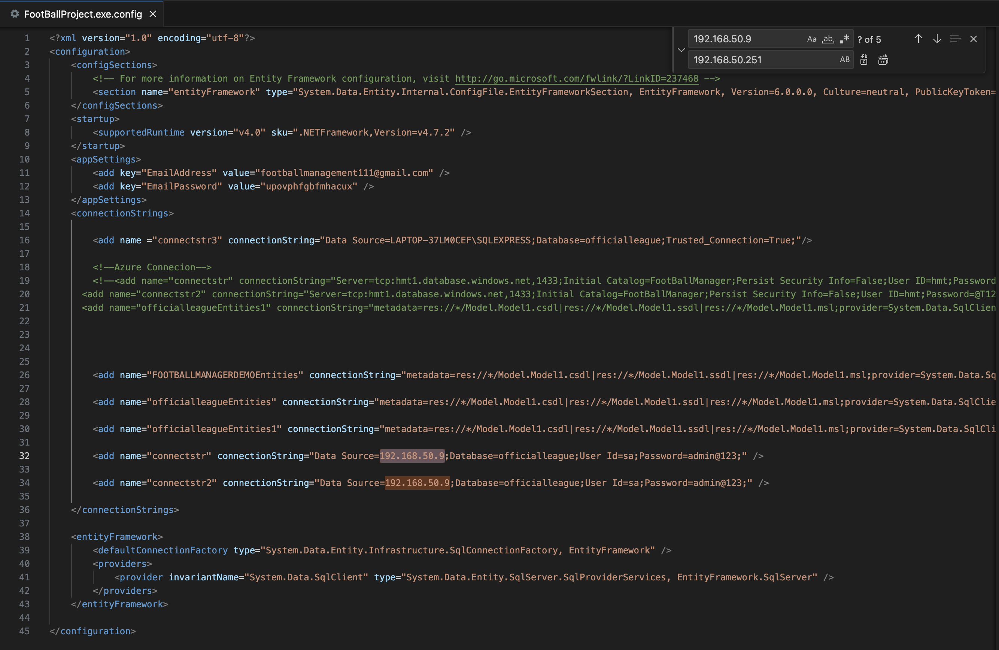

3. Sao chép tập tin `FootBallProject.exe.config`
   → Dán và ghi đè lên tập tin trong thư mục cài đặt phần mềm
   (Mặc định: `C:\Program Files (x86)\Tuong_301\FBM`)
   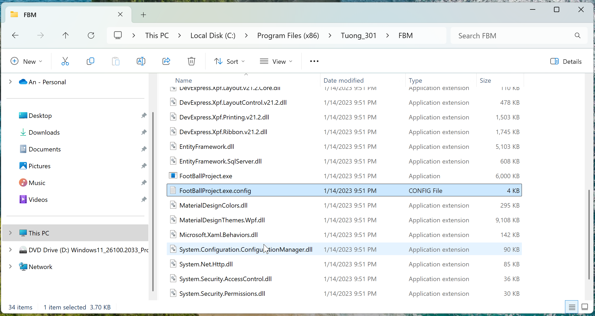
   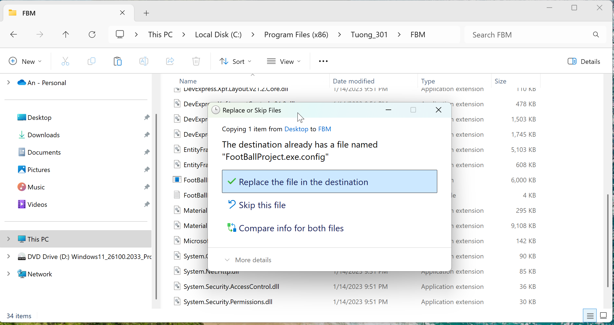
